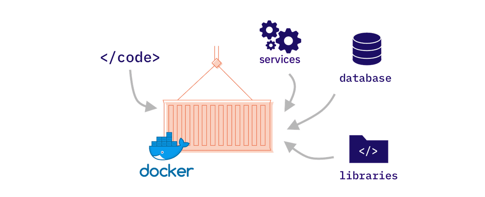
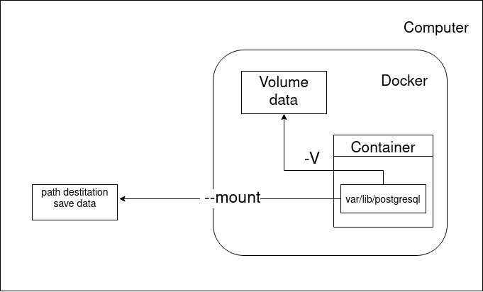

## Crée son dockerfile

Le dockerfile est une suite d'instruction qui indique à docker comment crée son container (une image).

Généré une image docker avec un dockerfile:
```bash
docker build . -t [name image]
```

Vérifier la présence des images docker
```bash
docker images
ou 
docker image ls
```


## Lancer une image docker
```bash
 docker run [name image]
 ```
- Option -i : interactif
- Option -t : terminal
  - Avec les Option -it utiliser ctrl+P et ctrl+Q pour sortir du mode interactif et de laisser le container en marche en arriére fond
  - Pour rattacher un container 
     ```bash
        docker attach [name generate by docker adjectif + name scientist]
     ```
  - Arrêter le container : exit
- Option --rm : supprime le container un fois arrété
- Option -p 3000:3500 : relie le port de l'host au port exposé du container 
- Option -v [name volume]: [path of file to save]: utiliser un volume

## Les volumes

Par défaut les container n'ont aucune persistance de donnée. A chaque arrêt d'un container les données son perdu.

Les volumes permet de faire persister des données 

Crée un volume:
```bash
docker volume create [name volume]
```

Voir les volumes:
```bash
docker volume ls
```

Inspecter un volume:
```bash
docker volume inspect [name volume]
```

lancer une image avec un volume exemple avec psql
```bash
docker run -v data:var/lib/postgresql/data postgres
```
Toutes les données du container présente au chemin var/lib/postgresql/data sera dans le volume data

ou

```bash
docker run --mount type=bind,source=[path destination save data],target=var/lib/postgresql/data
```
Toutes les données du container présent au chemin var/lib/postgresql/data sera dans le dossier [path destination save data] sur la machine host



## docker-compose

Docker compose permet de composé une suite complexe de plusieur container avec divers configurations.
Pour crée les intructions d'un docker compose on utilise un docker-compose.yml  

Pour executer un fichier docker-compose.yml
```bash
docker-compose up
```